Fonts I like, most of them with licenses permissible enough to be included in an iOS apps.	

* [Ostrich Sans](https://www.theleagueofmoveabletype.com/ostrich-sans)

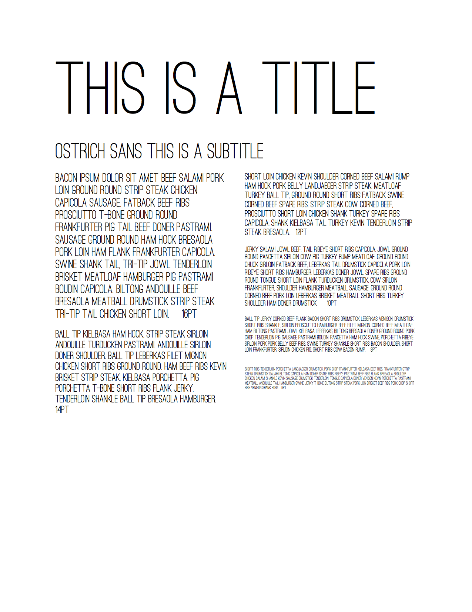

# [Oswald](http://www.fontsquirrel.com/fonts/oswald)

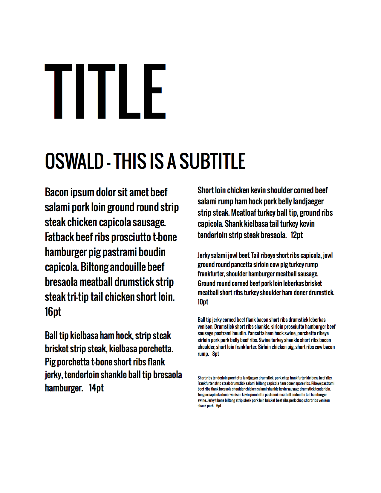

* [Rhyder](http://www.dafont.com/rhyder.font)

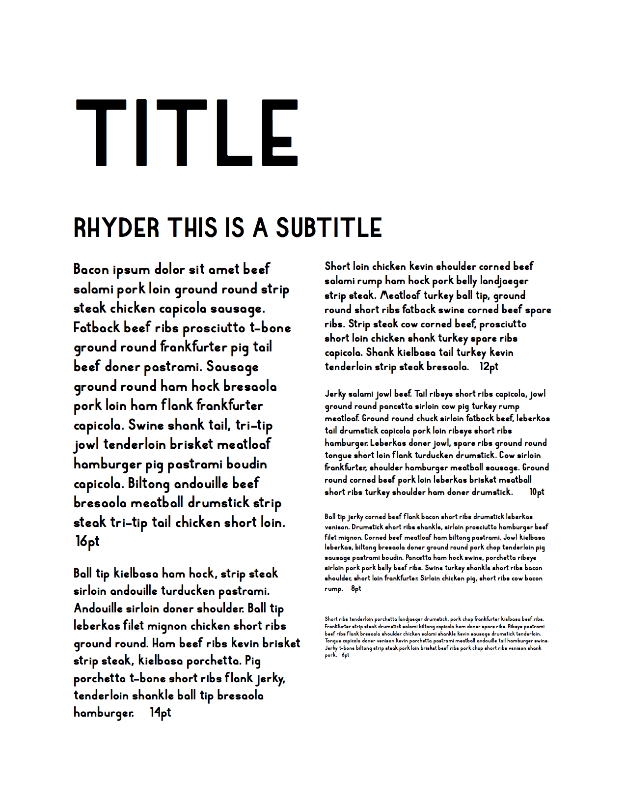

* [Bebas Neue](http://fontfabric.com/bebas-neue/) (web only, may not be redistributed)

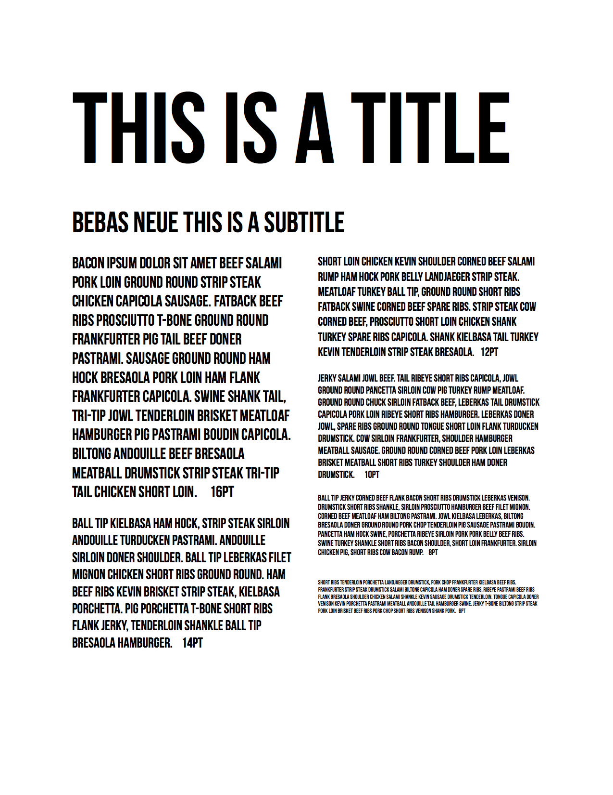

* [Quirky nots](https://www.behance.net/gallery/Quirky-Nots-(Free-Font)/9550009)

* [IM FELL DW PICA PRO](http://www.fontsquirrel.com/fonts/IM-FELL-DW-Pica-PRO)

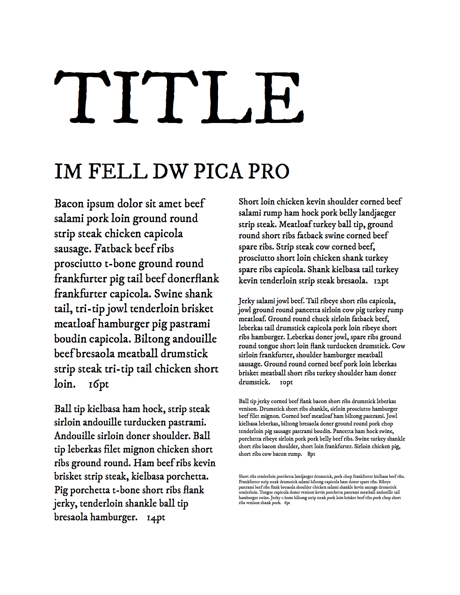

* [anonymous pro](http://www.marksimonson.com/fonts/view/anonymous-pro)

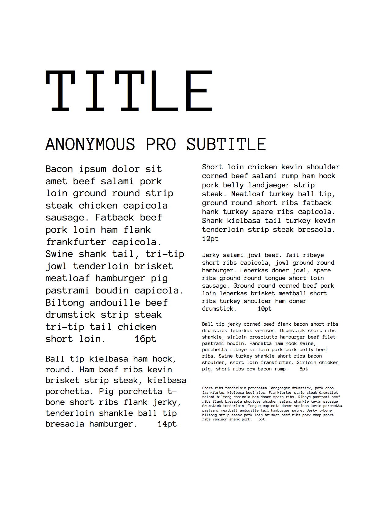

* [open sans](http://www.google.com/fonts/specimen/Open+Sans)

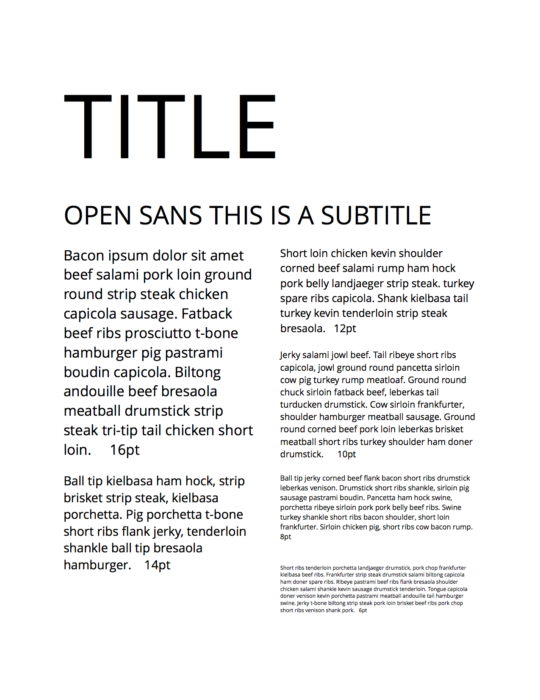

* [Quicksand](http://www.google.com/fonts/specimen/Quicksand)

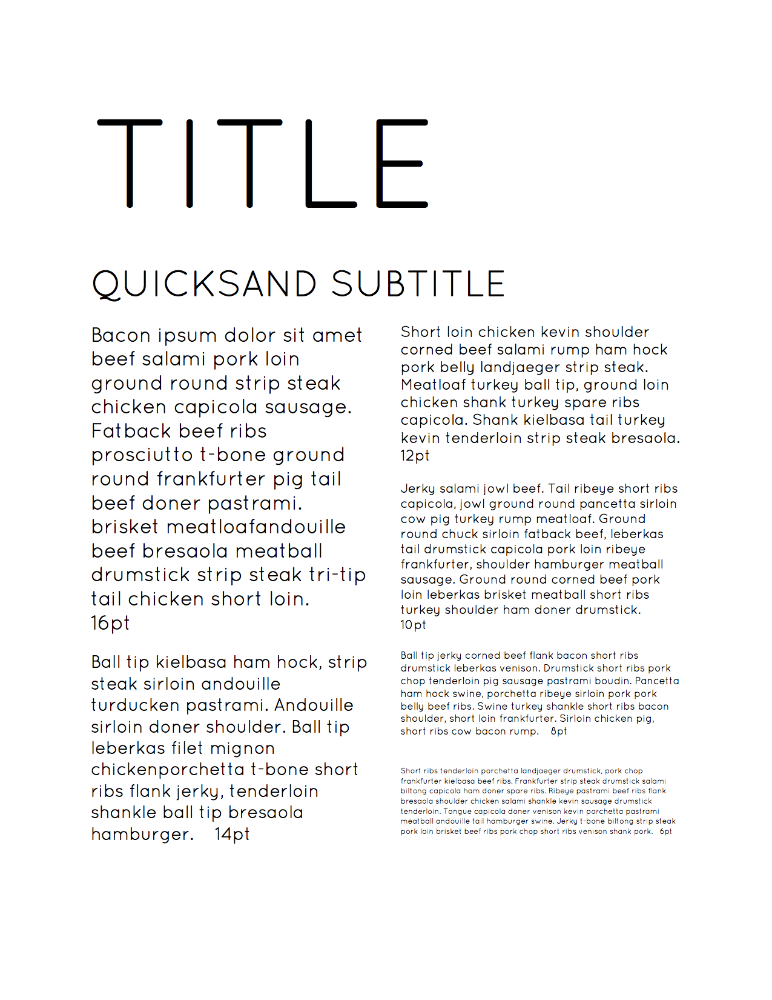

* [Comic Neue](http://comicneue.com/)

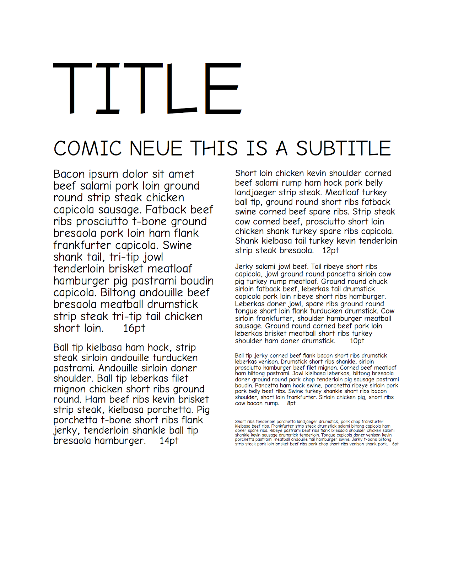

* [Raleway](https://www.google.com/fonts/specimen/Raleway)

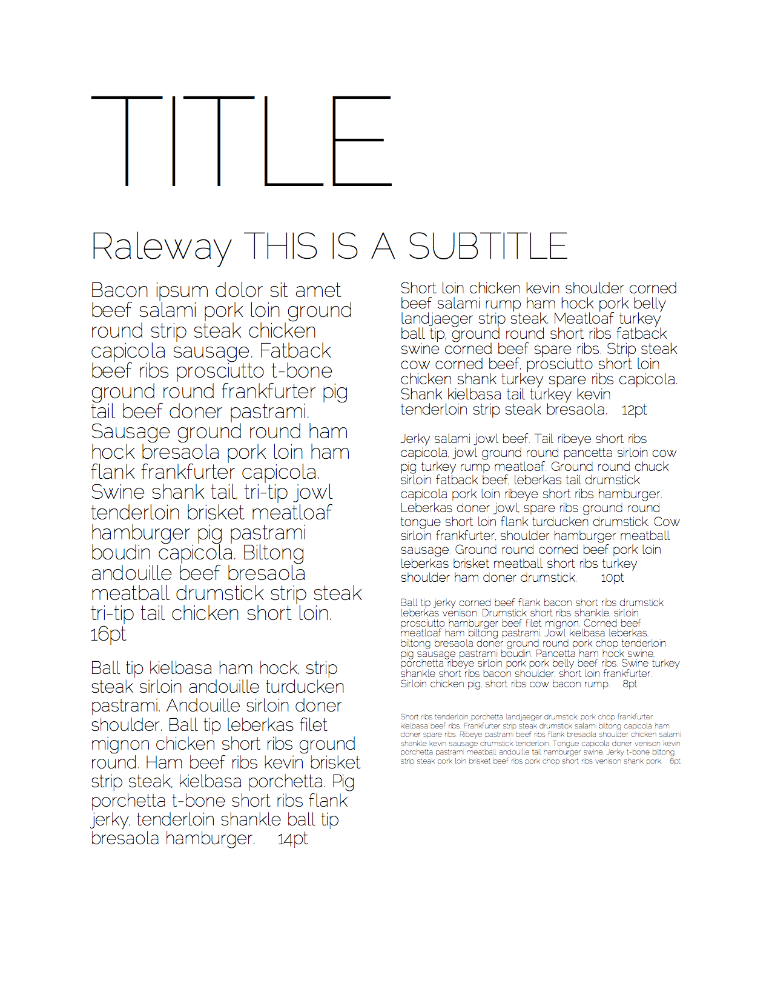

* [League Gothic](https://github.com/theleagueof/league-gothic)

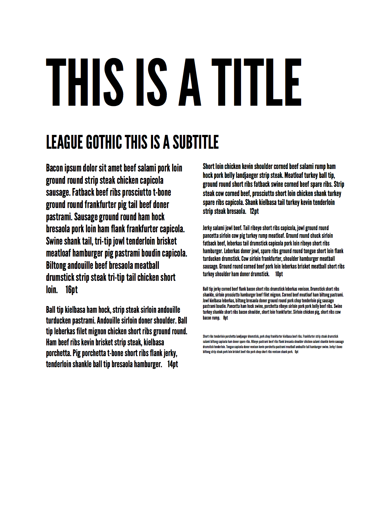

* [Junction](https://github.com/theleagueof/junction)

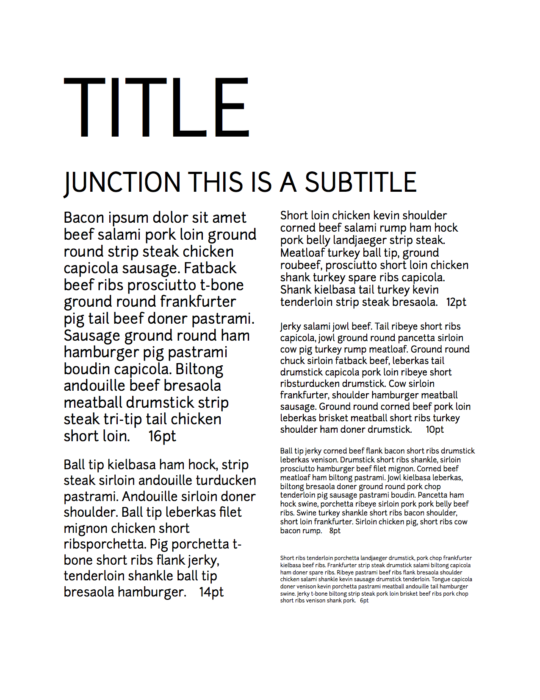

* [Hero](http://fontfabric.com/hero-free-font/)

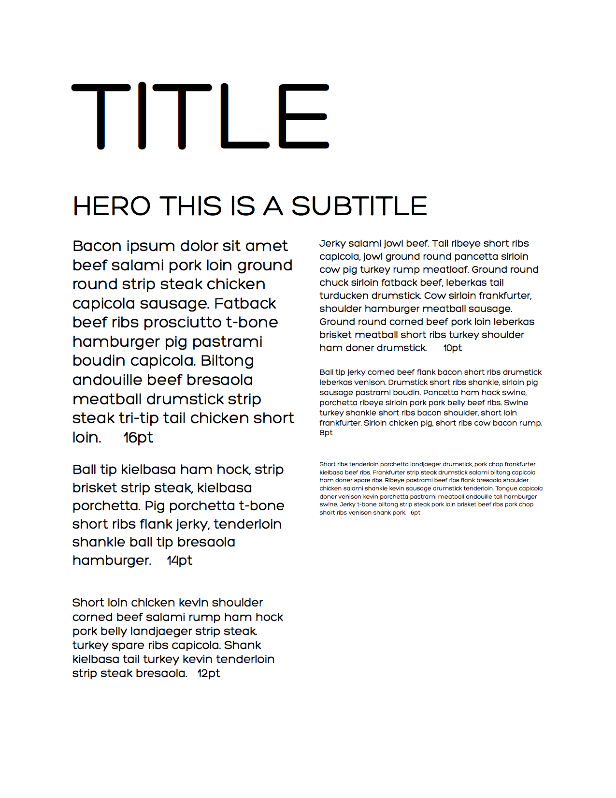
